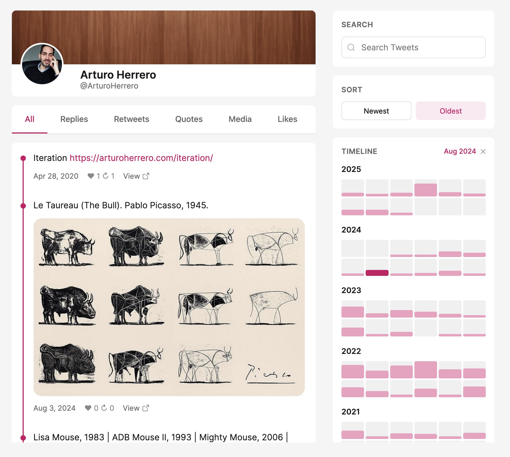

# Twitter Archive

This is my personal Twitter/𝕏 archive. The official 𝕏 archive wasn't a satisfactory
experience, so I built a better tool to review tweets and likes.

I can easily see all the tweets, or just the replies, retweets, quotes, or
media. Likes are also included as they are important for me—I use likes as items
I want to read/watch/investigate later.

The improvements involve a better User Interface to support threads, text
search, chronological sorting, and monthly activity visualization with filtering.

A picture is worth a thousand words:



## Usage

Download the 𝕏 archive and move the `data` directory into this project. Then
process it to remove most of the content and prepare the final data needed:

```sh
ruby scripts/archive.rb
```

Open the viewer:

```sh
open index.html
```

## Who made this?

This was made by Arturo Herrero. Follow me on 𝕏 [@ArturoHerrero](https://x.com/ArturoHerrero).
